# **License Plate Recognition Demo**

<!--- [0] --->

This repository serves to discuss the challenges currently in open-source quality data collection and the leveraging of Roboflow ; a new automated machine learning off-the-shelf solution aimed at improving machine learning operations through the use of auto-labeling and dataset quality tools. 

This repository demonstrates how to leverage Roboflow in developing a license plate recognition system, specifically for license plates used in the United States, however through testing Roboflow’s various capabilities I believe it provides a solid platform to develop projects for various use cases in machine learning. 

I am not sponsored by Roboflow nor did we communicate in any capacity. The rise of platforms tailored to reducing the intensive effort of collecting, labeling and validating datasets caught my attention after intensive efforts of building datasets to be used in machine learning applications for industry. Due to this, I wanted to educate myself in these tools further and document my journey while doing so in hopes that it will be of use to other engineers seeking to learn how to more efficiently develop datasets for their own journey in machine learning. 


# **Computer Vision Fundamentals**

<!--- [1] --->

Before we move further, I would like to level set and have a quick overview of computer vision fundamentals that will be necessary to understand to grasp what work the Roboflow platform is outsourcing for us in developing datasets. 

Machines cannot process images with the same biological mechanisms that we do, and thus other methods must be derived to mimic them. This begins by first understanding that all images can be presented by pixels. The image shown below of a 6 X 6 basic representation of a face. From here we will continue to add increasing layers of complexity to better understand the road map of training the necessary machine learning models. 

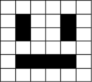

<!--- [2] --->

Each pixel is represented by 1 of 2 values: 0 or 1 . This corresponds in turn to whether a given pixel is black or white. Although we can easily interpret the face without resorting to analyzing the pixel values, machine learning relies on this interpretation to be able to extract features and classify the data being inputted. This involves technologies such as neural networks, transformers and accelerators that I will not be going into detail in as this document is focused on the efficiencies brought by Roboflow but could be found here for more information.

Note that in real-world settings, images are not two dimensional and instead are composed of 3 layers of RGB values corresponding to the intensity of red, green or blue. This intensity is represented by an 8-bit integer value from 0 to 255 for each respective color. 


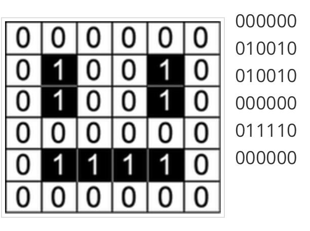

<!--- [3] --->

As shown below, even with just a 6 X 6 two-dimensional array many images could be contrived of varying complexity. Importantly, these images have a corresponding binary form that allow for the ability to use computation to perform tasks such as object detection, semantic segmentation and object tracking. 

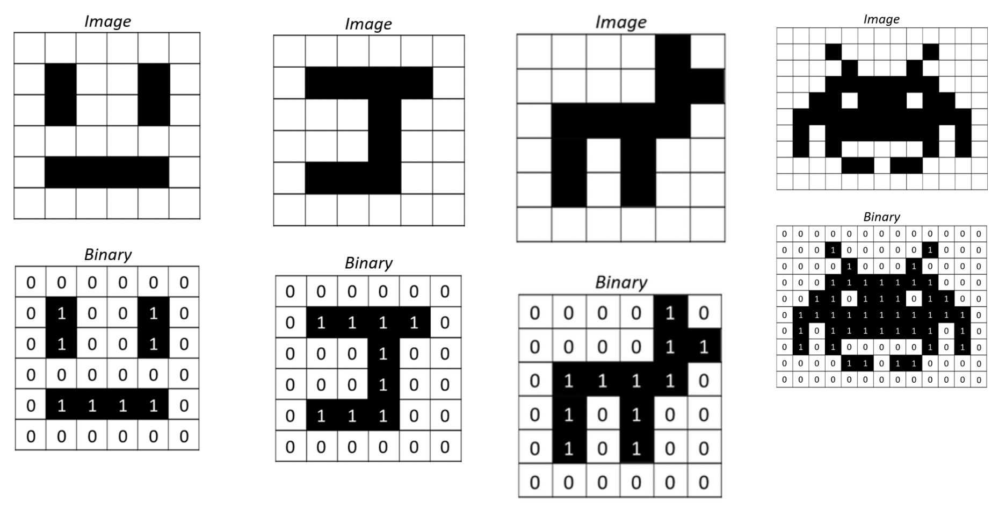

<!--- [4] --->

Let us take the previous color and now begin to add color to better illustrate what we are accustomed to now seeing on our phones. In this example, colors can still be presented with relatively few bits and thus any subsequent computations with standard practices on everyday computers are still possible. 

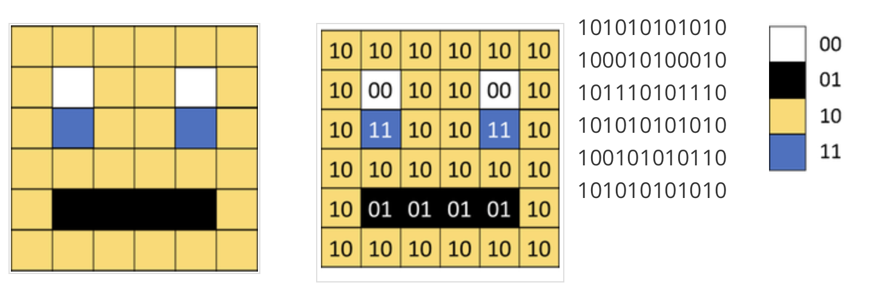

<!--- [5] --->

However, what happens when capture devices (i.e. cameras) improve to the point where we now need much more data to represent the images in question? How many bits of data would be used to represent the pixelated cat below and how does this increased data throughput affect the architecture of our recognition system?

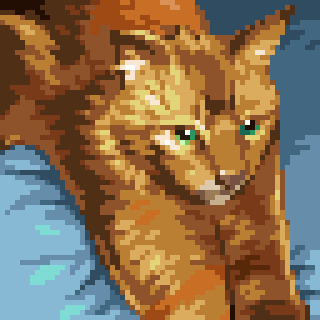

<!--- [6] --->

For example, the image below is of the family house cat “Marmalade” captured in 3024 X 4032 resolution. This image alone is over 12 million pixels that each require 3 bits of data to represent. For real-world applications many frames would be needed to train our models and form our datasets. Real-time applications such as object tracking through video cameras would require 30 – 60 frames per second to be practical while also maintaining low runtimes for inference. 


<!--- [7] --->

Analysis of data in these large amounts at great speed used to require expensive and powerful computing equipment but now could be done for under $100 at the edge using off-the-shelf solutions such as raspberry pi boards. The smaller footprint now needed to run such tasks allows for innovation across all products and what has allowed for accumulation of giant treasure chests of data in our daily lives.

# **Applications of Computer Vision in License Plate Recognition**

<!--- [8] --->

In the same manner that images of cats could be represented by pixels and bits, so too could any other image. However, for images to be useful they must typically be taken in higher resolutions. This increase in data needed to produce the images coupled with the already difficult task of teaching a machine how to understand them as inputs leads to the need of machine learning through computer vision to develop any application. 

For example, license plate recognition systems are necessary for security and compliance across roadways, hospitals, parking lots, government facilities and any other controlled security perimeter. For such a system to work properly, the license plate must be able to record across multiple light conditions, at varying speeds and be able to discern the target object versus other possible examples of noise that may be present in the environment. Otherwise, tollways would be unenforceable at scale, sensitive facilities such as hospitals and government offices would be unable to audit who has entered/exited a given space. Overall, this leads to a degradation in the possible avenues of security a group may possess. 

The advent of effective technologies such as convolutional neural networks enhancing computer vision performance allows for these applications to function and continue to grow.

# **Hardware Setup**

| Hardware Item: | Links: |
| --- | --- |
| [Apple M1 Macbook Pro - 1 TB SSD / 16 GB RAM](https://www.apple.com/shop/product/FK1F3LL/A/refurbished-16-inch-macbook-pro-apple-m1-pro-chip-with-10%E2%80%91core-cpu-and-16%E2%80%91core-gpu-silver) | [https://www.apple.com/shop/product/FK1F3LL/A/refurbished-16-inch-macbook-pro-apple-m1-pro-chip-with-10‑core-cpu-and-16‑core-gpu-silver](https://www.apple.com/shop/product/FK1F3LL/A/refurbished-16-inch-macbook-pro-apple-m1-pro-chip-with-10%E2%80%91core-cpu-and-16%E2%80%91core-gpu-silver) |
| [Raspberry PI Model 4B](https://www.raspberrypi.com/products/raspberry-pi-4-model-b/) | https://www.raspberrypi.com/products/raspberry-pi-4-model-b/ |
| [GoPro Hero 4 Black](https://www.amazon.com/GoPro-HERO4-Camera-Certified-Refurbished/dp/B0788P1B3Y?th=1) | https://www.amazon.com/GoPro-HERO4-Camera-Certified-Refurbished/dp/B0788P1B3Y?th=1 |
| [Camera Stability Rig](https://github.com/Kelvinayala10/private-lpr/blob/main/doc/camera_rig.md) | [See This Link For More Details](https://github.com/Kelvinayala10/private-lpr/blob/main/doc/camera_rig.md) |

# **Software Setup**

| Software Items: | Links |
| --- | --- |
| [Roboflow](https://roboflow.com) | https://roboflow.com |
| Requirements.txt | 1.  [Model Compilation Using Roboflow - Macbook](requirements_macbook.txt)<br>2.  [Model Inference - ARM based Raspberry Pi 4B](requirements_rpi4b.txt) |
| [Useful Links](doc/3rd_party_data_source_links.txt) | [See this link for further LPR dataset resources](doc/3rd_party_data_source_links.txt) |

# **Acquiring Images to Build Training Dataset**

<!--- [9] --->

Currently, there are not many options available to curate a dataset composed of license plates from the United States. The few resources that are found publicly, found [here](doc/3rd_party_data_source_links.txt), are not licensed for commercial applications and thus it becomes necessary to manually create new datasets for each prototype application. This blocks companies and teams from being able to develop new software and methodologies in applications such as license plate recognition as now countless man-hours must now be used to collect data in public domains. When this is completed, even if data is collected on public roads/spaces, companies would be wary of disclosing this action stemming from the emergence of possible avenues of litigation from increased data privacy protection llaws such as the [GDPR](https://gdpr-info.eu) and [CCPA](https://oag.ca.gov/privacy/ccpa). 

This situation is further complicated by the fact that unlike other nations, the possible license plate designs and lettering format differs greatly from state-to-state. For comparison, currently license plates in Texas for the most part have a white background with black lettering in a format of 3 letters followed by 4 numbers in the format of “ABC-1234”. However, given that there are license plates still around spanning decades and the numerous customizations that a given driver may use, even in a relatively simple design such as Texas, there are still multiple possible combinations of plates that must be accounted for when developing a dataset that reflects all possible cases in real-world scenarios. 

Take the license plate shown below as an example, this license plate was custom made to use in this project and is the only license plate that is not anonymized as it is on one of my personal vehicles. Likewise, as of the writing of this documentation “MLE2024” is not registered to any vehicle in Texas. All figures found in this document that contain license plate data have been altered in post-production to grey out the last 4 characters of a given license plate — the same practice that is currently being used by ride-sharing companies in an effort to increase privacy protection for drivers. 


<!--- [10] --->

With this in mind, it became clear why companies decide to keep their already acquired “ golden datasets ” to themselves as it de-facto acts as a moat from budding competitors who would challenge their existing market share in government and private entities that are looking to implement some sort of automated license plate recognition system for applications such as security and monitoring.  The resources and effort invested into creating these datasets would need to be repeated by any new group looking to enter the market to compete in this space. I have been involved in numerous projects where this issue continues to reoccur. When there is no existing data collection infrastructure in place, it becomes a gargantuan ask to spin one up in an ad-hoc fashion without having the proper resources in place to execute on the ask. Thus the question shifts to what then can a novice team use to begin with to minimize the time for curating a dataset that will be sufficient to build machine learning applications on top of. It is here where I discovered Roboflow in my search after working on multiple projects where a brand new dataset needed to be produced and refined to test as a proof-of-concept for company strategists. 

# **Roboflow Explained**


<!--- [11] --->
Roboflow is a platform designed to streamline the process of preparing, managing, and deploying computer vision models. It provides a suite of tools and features aimed at simplifying the complexities of training and deploying computer vision models. Here's a breakdown of what Roboflow does:

1. **Data Preparation:** Roboflow helps users prepare their image datasets for training by providing tools for data augmentation, labeling, and annotation. This includes tasks such as resizing images, labeling objects of interest, and cleaning up noisy or incomplete data.

2. **Data Management:** The platform offers tools for organizing and managing large image datasets efficiently. Users can upload, store, and version control their datasets, making it easier to collaborate with team members and track changes over time.

3. **Model Training:** Roboflow supports training of computer vision models using popular frameworks like TensorFlow, PyTorch, and others. It provides integrations with various training environments and cloud platforms, allowing users to train models using their preferred tools and infrastructure.

4. **Model Evaluation:** Once trained, Roboflow helps users evaluate the performance of their models using metrics such as accuracy, precision, recall, and others. This allows users to assess the effectiveness of their models and identify areas for improvement.

5. **Model Deployment:** The platform facilitates the deployment of trained models into production environments. It provides tools for exporting models to various formats, integrating them with existing applications or workflows, and deploying them to cloud or edge devices.

Overall, Roboflow aims to simplify the end-to-end process of building and deploying computer vision applications, enabling developers and researchers to focus more on solving problems and less on managing infrastructure and workflows.


# **Batch Uploading and Annotating Dataset Images**

<!--- [12] --->

Using a custom camera platform, I was able to collect hundreds of images of license plates in my local community. From these 697 images were chosen to compose the beginning of my machine learning dataset that would be used to train the model to recognize license plates. Roboflow’s simple interface allowed me to upload the images and within 15 minutes my training images were to proceed to the next stage of labeling and annotations. 


<!--- [13] --->

Roboflow offers multiple methods to label images however my reason for exploring the platform was to judge how it would perform without the need for human-intervention in time consuming manual labeling through a service called “ Auto Label” that at the time of this document was currently in beta. 


<!--- [14] --->

Using this auto label service, you can input the given classes that would be found in the dataset and also include prompts that would be coupled with them if identified in the testing images. 


# **Roboflow Auto Labeling Using Grounding DINO**

<!--- [15] --->

The automatic labeling service leverages “Grounding DINO” . This is an open-set object detector that leverages existing transformer-based detectors such as DINO however then further enriches it with grounded pre-training. This allows for the detection of any arbitrary objects that are not in the original set with the aid of text inputs such as category names. This essentially begins to bring together the functions of computer vision and natural language processing to enhance the performance of the object detector in total.


<!--- [16] --->

As shown, at a confidence threshold of 50% , the automatic labeling service is able to detect the license plates that are being focused as the center of the subject detection at the time. Notice however that other nearby license plates are not immediately recognized. 

Note: all license plates have been anonymized by greying out the last 4 digits. The original label and bounding box provided by Roboflow are marked in green.


<!--- [17] --->

At a higher confidence threshold of 95% it could be seen that the original properly labeled test image is no longer detect a valid license plate class. This is because it is now overfitting for the original inputs and now false negatives would continue to become more frequent. 


<!--- [18] --->

The inverse effect could also be seen when decreasing the confidence threshold to 35% . Now there are more license plates that could be detected that were previously ignored. Notice that these plates were captured at a further distance and thus due to compression of the image, had less data (in the form of pixels) present to represent its’ features. Naturally when the subject of in a photograph is close to the capture device, the image would appear larger and in focus which then leads to increased chances of proper detection through the object detector. 


<!--- [19] --->

At a lower confidence threshold of 10% the automated labeling begins to show the range of its’ limitations. At this threshold, false positives begin to become more common. The labeling model begins to experience underfitting as evident by the degradation of proper bounding box placements from the previous testing exercises.


<!--- [20] --->

For the remainder of testing, I proceeded to use a confidence threshold of 35% as it was robust enough to test as a proof-of-concept for curating quality datasets to build machine learning applications from. 


<!--- [21] --->

If future engineers should happen to recreate this project for their own experimentation; please note that the auto labeling feature does have a limit of up to 1000 images.


<!--- [22] --->

Also, note that auto labeling is not instantaneous . It will take several hours for the data to be processed. In my testing, I never waited more than 6 hours to get my dataset labeled properly. 


# **Auto Label Input Dataset Details**

<!--- [23] --->

When using the automatic labeling tool; the images will be split into three categories for training, validation and testing in proportions of 70%, 20% and 10% respectively. 


<!--- [24] --->

Roboflow allows for the review of each image split into the specific image set category as shown below. 


<!--- [25] --->

Roboflow also offers details regarding the dataset images that would allow for quality audits and overall descriptors of the data to track for future debugging should it be necessary.


<!--- [26] --->

A large portion of the images collected to curate the dataset had multiple license plates in them. The overall distribution of the data could be shown below. 


<!--- [27] --->

Further analysis of the dataset images reveals through the “annotation heatmap” that images typically detected license plates along the center of the capture image which is to be expected as the capture device camera was aligned horizontally at the height of where license plates are typically placed on a vehicle.


<!--- [28] --->

These annotations could be modified using provided tooling that will be explored further in the next section.

# **Annotation Editor and Model Selection**

<!--- [29] --->

Note that all license plates in focus in the following figures were first inputted as taken and then anonymized by obscuring the last 4 characters of the license plate. 


<!--- [30] --->

As shown, the coordinates of the bound boxes could be adjusted manually if a given user finds that the auto labeling service either did not capture a license plate in the image inputted or perhaps that the generate bounding box is not overlayed properly on the image. In my experimentation I found that most images were indeed overlayed with accepted bounding boxes and thus I only used this tool sparingly. However, note that this may not be the case for future experiments due to the multitude of factors that could affect performance for a given image. 


<!--- [31] --->

Note that not all images need to be manually reviewed for their bounding box placement and that overall you could approve all automatically labeled images if you are satisfied with its’ overall performance. 


<!--- [32] --->

The automatic labeling tool was trained using Microsoft’s COCO dataset that incorporates standard everyday objects. This was adequate for my use case as license plates have not changed in the past decades. However, there are some concerns with using COCO as there are several classes of objects that have indeed changed with time since the data has been collected such as smartphones. I urge to weigh the benefits of using COCO on a case-by-case basis but have found it quite robust for most general purpose use cases.


<!--- [33] --->

Roboflow also allows for the augmentation of dataset images to increase robustness in real-world applications. Images were randomly selected to be augmented with varying levels of saturation and exposure. Further augmentation steps could be added however I found that for my purposes this was enough. 


<!--- [34] --->

We will proceed to examine the auto labeling workflow further in the next section.

# **Auto Labeling Workflow**

<!--- [35] --->

You can review the stages of your dataset creation and annotation through the dataset view below.


<!--- [36] --->

Roboflow will notify users when the model trained on your inputted data is ready to use and deploy. There are key significant details given on model performance found 95.3% mAP, 84.4% precision and 93.7% recall. 


<!--- [37] --->

In the context of machine learning, particularly in tasks like object detection and classification, several metrics are used to evaluate the performance of a model. Here is quick explanation for these terms :

1. **Mean Average Precision (mAP)**:
   - mAP is a popular metric used to evaluate the performance of object detection models. 
   - It combines both precision and recall into a single measure. 
   - In object detection tasks, multiple objects may exist in an image, and the model's output usually includes bounding boxes and associated confidence scores for each detected object. 
   - Precision and recall are calculated at various confidence thresholds, and mAP computes the average precision across all these thresholds.
   - Essentially, it provides an aggregated measure of how well the model performs in terms of both precision and recall across different confidence thresholds.

2. **Precision**:
   - Precision measures the accuracy of the positive predictions made by the model. 
   - It is the ratio of true positive predictions to the total number of positive predictions made by the model (true positives + false positives).
   - Precision indicates how many of the items labeled as positive by the model are actually true positives, thereby quantifying the model's ability to avoid false positives.

3. **Recall**:
   - Recall, also known as sensitivity or true positive rate, measures the ability of the model to correctly identify all relevant instances (true positives) from the total number of actual positive instances.
   - It is the ratio of true positive predictions to the total number of actual positive instances (true positives + false negatives).
   - Recall quantifies the model's ability to avoid false negatives by capturing all relevant instances of the positive class.

In summary, precision and recall are complementary metrics used to evaluate the performance of machine learning models, particularly in binary classification tasks. Precision focuses on the accuracy of positive predictions, while recall focuses on the model's ability to identify all relevant instances of the positive class. mAP extends these concepts to the evaluation of object detection models, providing a comprehensive measure that considers both precision and recall across different confidence thresholds.


<!--- [38] --->

Once all review jobs have been completed, you will find that the datasets are now ready to be used and the “review” column has been dropped as there is no longer a job to be ran on the inputted data. 

# **Preprocessing and Augmentation of License Plate Recognition Dataset**

<!--- [39] --->

The YOLO-NAS object detection model performs optimally when all input images are of the same dimensions and thus the dataset images must be preprocessed before inputted into the model as shown . This action also reduces the overhead computational complexity that would be needed for inference on the input data. More preprocessing steps could have been added in addition to resizing the images however I was satisfied with the initial performance measures that were examined to deem them marginal for the possible gains in performance that would come at the burden of increased development and training time for tuning the model.


To increase the robustness of the dataset for machine learning inference under different input conditions from the environment, saturation and exposure of the captured images were modified to be used in training the model.


Once all the necessary transformations to the data have been completed, a dataset could be saved as to have a reference point to roll back to compare performance metrics of a trained model from one dataset to the next. A highly useful feature that I found helpful when testing different captured datasets. 


# **Model Training Results and Observations**

<!--- [49] --->

You are able to review the status of your dataset and Roboflow conveniently offloads the processing of the input images to their own internal systems thus eliminating the need to develop on a specific cloud platform. Similarly, rapid prototyping is made possible as there would be no testing to determine how much compute should be allocated for certain datasets over others. 

*Unfortunately, I can not confirm if racoons were indeed fed.*
 

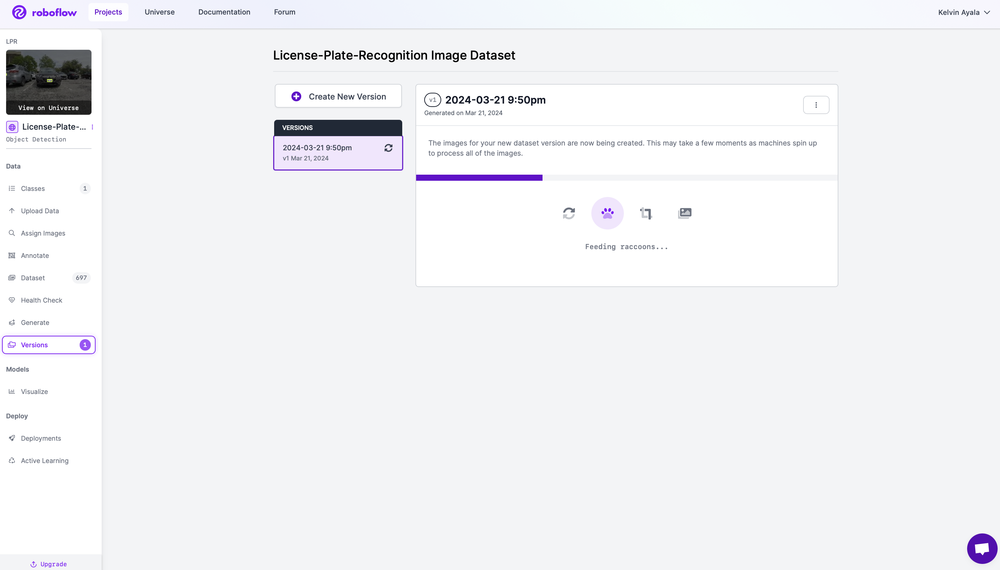

<!--- [50] --->

Roboflow allows multiple options for deployable models however I chose to continue with the YOLO-NAS path as I had previous experience with YOLOv8 in industry and overall, I wanted to delve into the subject matter further as YOLO’s single-pass algorithm outperforms traditional RNN and CNN methods for real-time applications. This is key with the end goal being real-time detection on edge devices.

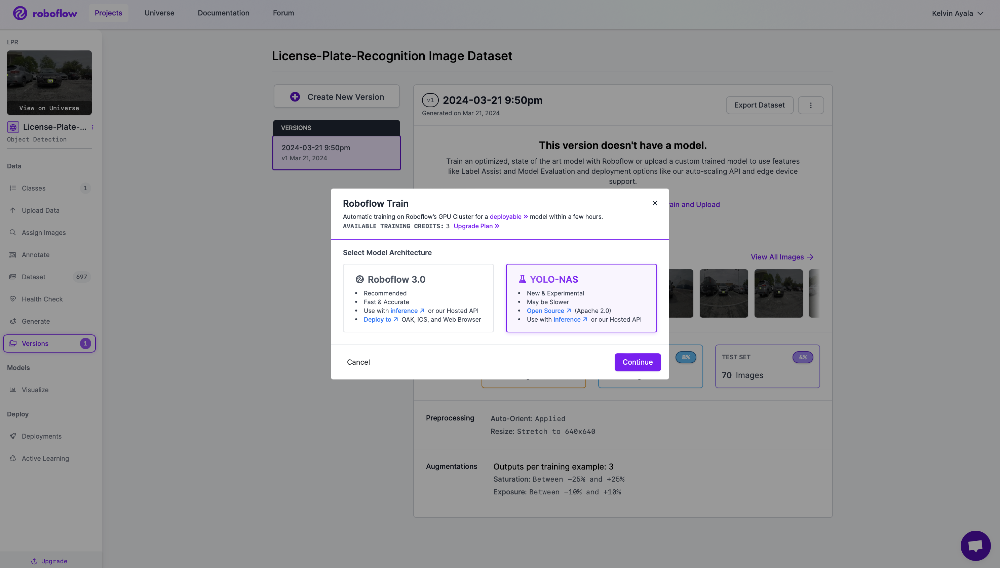

<!--- [52] --->

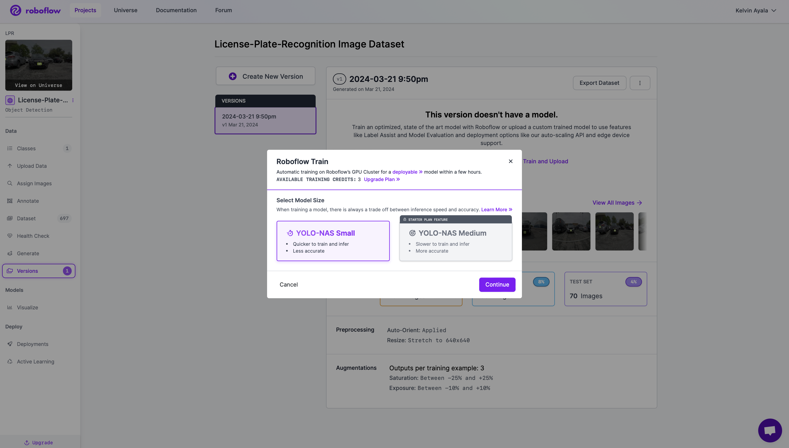

<!--- [53] --->

Microsoft’s COCO model was used to serve as a benchmark model to reduce training and improve overall performance metrics. I had used COCO previously to train retail shopping cart demos and although there were some faults to its’ dated training set, for a majority of everyday items, it still holds strong for most training purposes. 


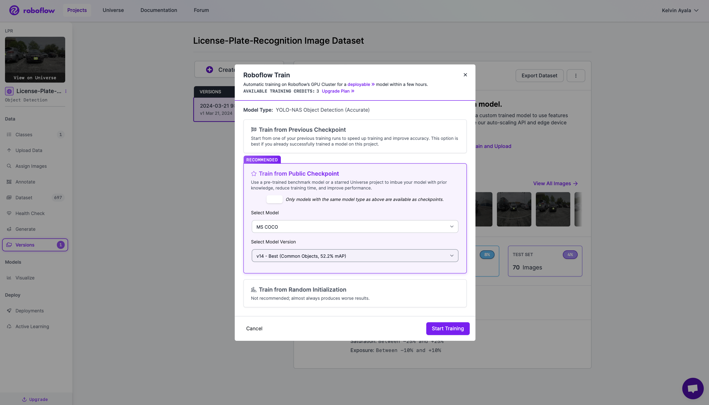


There will be several object-detection specific model performance metrics that will be plotted. The mean average precision(mAP) compares the ground-truth bounding box to the detected box and returns a score. The higher the score, the more accurate the model is in its detections. The mAP plot as shown plateaus early on in the training as evident that after 2-3 epochs the performance increase is negligible. If compute resources were needed to be sourced by the user rather than by Roboflow, this would bring about cost inefficiency for intense training workloads. 


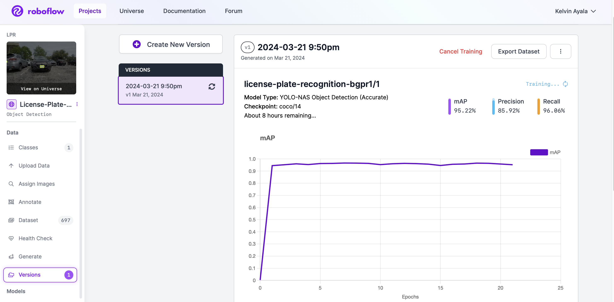


<!--- [61] --->


There were multiple formats to export the generate model artifacts. For my purposes I tested a variety of YOLO and PyTorch file formats to find an optimal solution brought about by my Raspberry Pi’s limited computer resources.


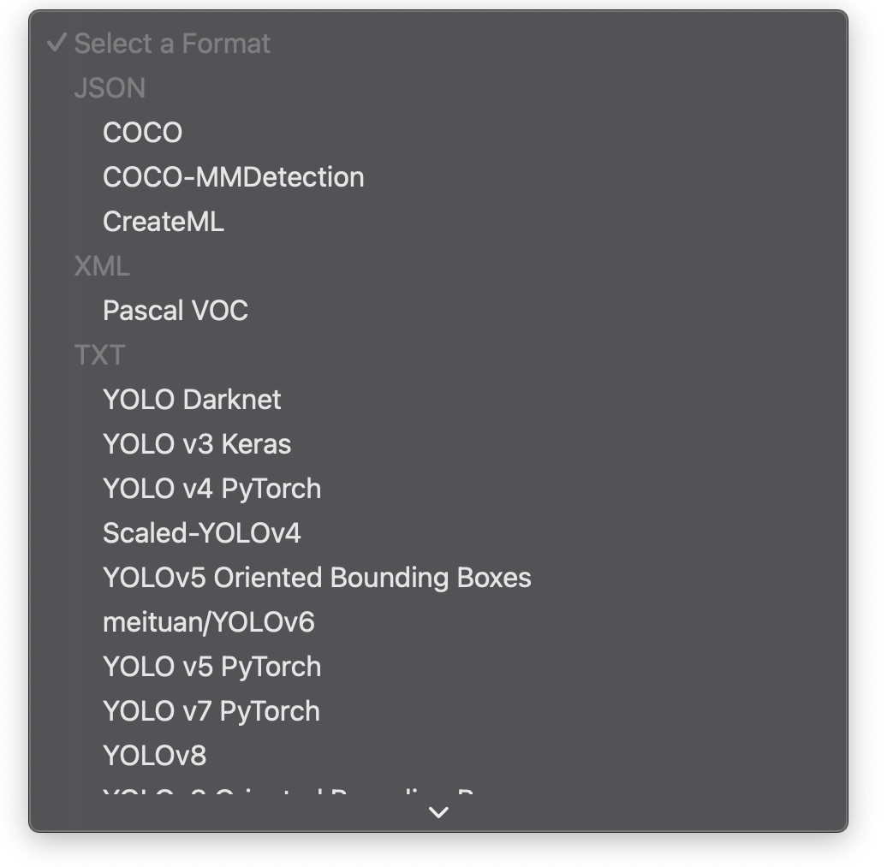

<!--- [62] --->


# **Visualizing Model and Adjustable Modifications**

<!--- [66] --->

Once your dataset and model are completed, there will be a dashboard and visualization generated with key details on your data. This provides a quick snapshot when needed as to avoid having to go through source files or previous model building history.


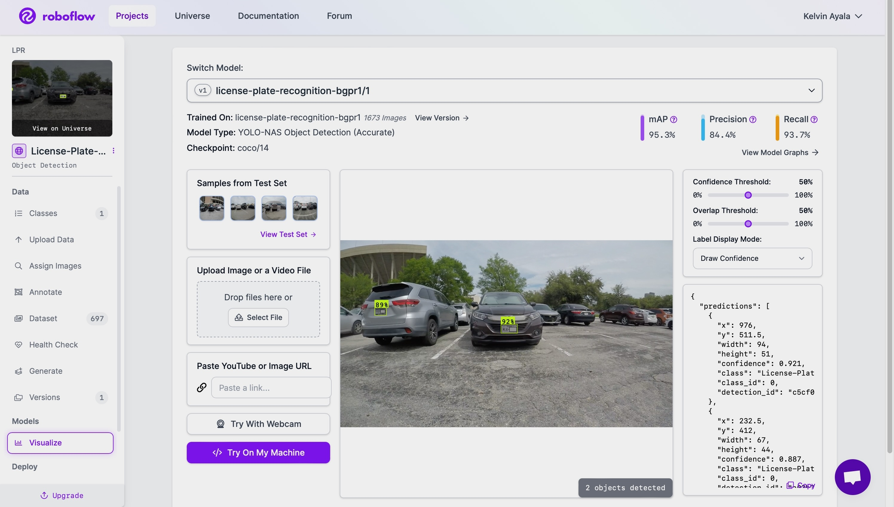


# **Deploying to Edge Devices**

<!--- [68] --->

The following figures and instructions are only valid during the time of writing and could have been updated since. Please review Roboflow’s official documentation for more clarity should this be the case. 

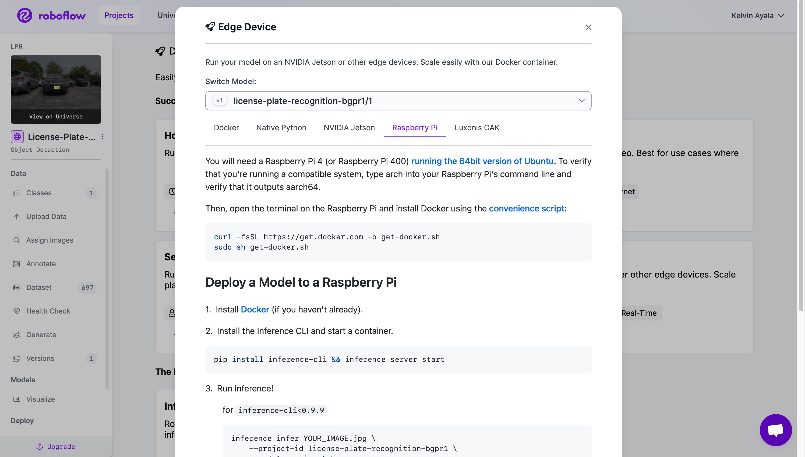


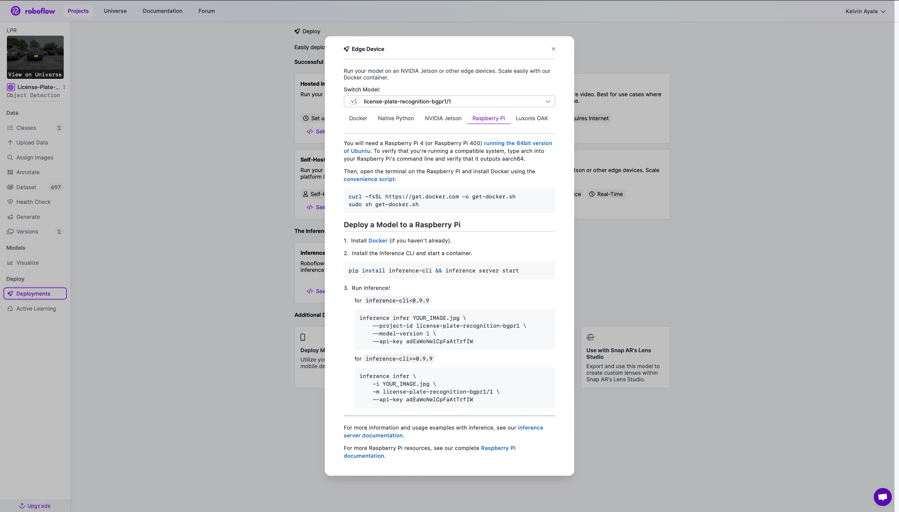

There are numerous inference options offered. This was welcomed as up to this point no infrastructure was needed from the user side to be deployed or constructed to meet our needs and what is created at the end of it all are the necessary files that would be needed to deploy to an edge device to execute machine learning inference on. Likewise, similar solutions could be deployed on cloud-hosted services such as AWS and GCP. I am including a very informative guide below that further walks through the available options that are abstracted away to Roboflow and thus allowing machine learning engineers to focus primarily on refining the model data rather than the overall infrastructure that is powering it. 
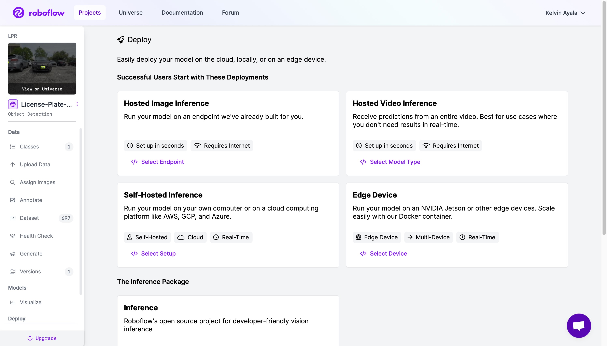


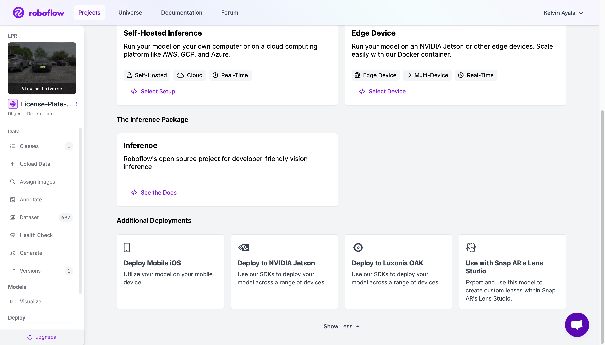


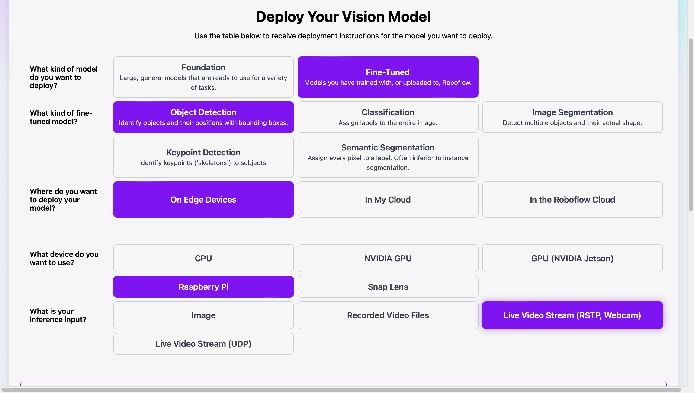

<!--- [73] --->

The code below serves as scaffolding to build to begin to develop on a user’s chosen edge device. In this block code note that it references using a webcam or another input capture device. For my purposes, I was not concerned with real-time streaming at high frames-per-second and nor could my Raspberry Pi 4b+ handle such a task without major decrease in performance. Thus, I deployed the model on my device and called to it each time a new image was detected. Although this approach worked when capturing license plates at slow speeds through a parking lot, more work and resources would be needed to scale this system up to one that would be able to handle input at higher rates. 


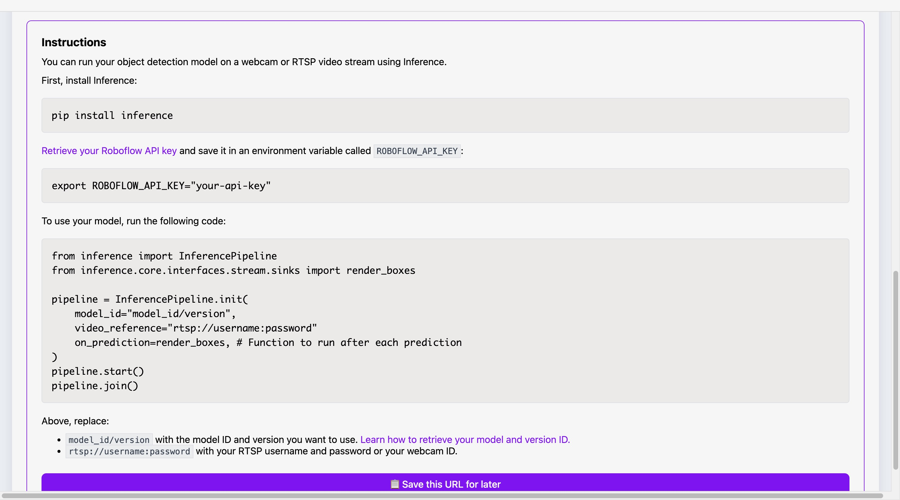

<!--- [74] --->

The below commands and logs were direct outputs during my builds using the provided Docker files to deploy to raspberry pi edge devices:

```
kelvin@kelvin-rpi:~/projects/LPR$ curl -fsSL https://get.docker.com -o get-docker.sh
kelvin@kelvin-rpi:~/projects/LPR$ sudo sh get-docker.sh
# Executing docker install script, commit: e5543d473431b782227f8908005543bb4389b8de
+ sh -c apt-get update -qq >/dev/null
+ sh -c DEBIAN_FRONTEND=noninteractive apt-get install -y -qq apt-transport-https ca-certificates curl >/dev/null
+ sh -c install -m 0755 -d /etc/apt/keyrings
+ sh -c curl -fsSL "https://download.docker.com/linux/ubuntu/gpg" | gpg --dearmor --yes -o /etc/apt/keyrings/docker.gpg
+ sh -c chmod a+r /etc/apt/keyrings/docker.gpg
+ sh -c echo "deb [arch=arm64 signed-by=/etc/apt/keyrings/docker.gpg] https://download.docker.com/linux/ubuntu jammy stable" > /etc/apt/sources.list.d/docker.list
+ sh -c apt-get update -qq >/dev/null
+ sh -c DEBIAN_FRONTEND=noninteractive apt-get install -y -qq docker-ce docker-ce-cli containerd.io docker-compose-plugin docker-ce-rootless-extras docker-buildx-plugin >/dev/null
+ sh -c docker version
Client: Docker Engine - Community
 Version:           26.0.0
 API version:       1.45
 Go version:        go1.21.8
 Git commit:        2ae903e
 Built:             Wed Mar 20 15:18:14 2024
 OS/Arch:           linux/arm64
 Context:           default

Server: Docker Engine - Community
 Engine:
  Version:          26.0.0
  API version:      1.45 (minimum version 1.24)
  Go version:       go1.21.8
  Git commit:       8b79278
  Built:            Wed Mar 20 15:18:14 2024
  OS/Arch:          linux/arm64
  Experimental:     false
 containerd:
  Version:          1.6.28
  GitCommit:        ae07eda36dd25f8a1b98dfbf587313b99c0190bb
 runc:
  Version:          1.1.12
  GitCommit:        v1.1.12-0-g51d5e94
 docker-init:
  Version:          0.19.0
  GitCommit:        de40ad0

================================================================================

To run Docker as a non-privileged user, consider setting up the
Docker daemon in rootless mode for your user:

    dockerd-rootless-setuptool.sh install

Visit https://docs.docker.com/go/rootless/ to learn about rootless mode.


To run the Docker daemon as a fully privileged service, but granting non-root
users access, refer to https://docs.docker.com/go/daemon-access/

WARNING: Access to the remote API on a privileged Docker daemon is equivalent
         to root access on the host. Refer to the 'Docker daemon attack surface'
         documentation for details: https://docs.docker.com/go/attack-surface/

================================================================================

kelvin@kelvin-rpi:~/projects/LPR$ 


```


```
==============================================================================

kelvin@kelvin-rpi:~/projects/LPR$ sudo docker run --net=host roboflow/inference-server:cpu
Unable to find image 'roboflow/inference-server:cpu' locally
cpu: Pulling from roboflow/inference-server
ffe6f70103a5: Pull complete 
e6015437b268: Pull complete 
b636c1c33eb3: Pull complete 
29d7def41015: Pull complete 
73d1d796f151: Pull complete 
4f4fb700ef54: Pull complete 
ac207842f8fe: Pull complete 
ba698169a9c1: Pull complete 
Digest: sha256:8e931b1d1daa3a319a9ec70698613d8740bcdf4ad2205b709f33708cb2127a69
Status: Downloaded newer image for roboflow/inference-server:cpu
2024-03-24T01:46:51: PM2 log: Launching in no daemon mode
2024-03-24T01:46:51: PM2 log: [Watch] Start watching inference-server
2024-03-24T01:46:51: PM2 log: App [inference-server:0] starting in -cluster mode-
2024-03-24T01:46:51: PM2 log: App [inference-server:0] online
initializing...
inference-server is ready to receive traffic.
```

Below is what you should expect to see after a successful build  and run on your edge device:

```
kelvin@kelvin-rpi:~/projects/LPR$ sudo docker run -it --rm -p 9001:9001 roboflow/roboflow-inference-server-arm-cpu
Unable to find image 'roboflow/roboflow-inference-server-arm-cpu:latest' locally
latest: Pulling from roboflow/roboflow-inference-server-arm-cpu
41f92d5a73b9: Pull complete 
40589f858a36: Pull complete 
20e2e3c78626: Pull complete 
780c865e967c: Pull complete 
e810819cbb97: Pull complete 
497d90e21f17: Pull complete 
50c17456476b: Pull complete 
82675460cf19: Pull complete 
10f1c9aef681: Pull complete 
e5683ae4e395: Pull complete 
811f9d4271ef: Pull complete 
Digest: sha256:0b63419ea4d2b54022afabedb8733fdb056fadf7366ee0f1cbd827afe1ee465b
Status: Downloaded newer image for roboflow/roboflow-inference-server-arm-cpu:latest
[03/24/24 04:51:39] INFO     UUID: 0d459645-440e-4428-ac2b-0142f7d4e1e4                                                   pingback.py:70
INFO:     Started server process [8]
INFO:     Waiting for application startup.
INFO:     Application startup complete.
INFO:     Uvicorn running on http://0.0.0.0:9001 (Press CTRL+C to quit)
```

The output logs below are what should be expected to be outputted once the model is called to review a new input image:


```
INFO:     Application startup complete.
INFO:     Uvicorn running on http://0.0.0.0:9001 (Press CTRL+C to quit)
[03/24/24 05:51:39] INFO     Sent pingback to Roboflow https://api.roboflow.com/pingback at {'api_key': 'no_model_used', pingback.py:163
                             'container': {'startup_time': '1711255899', 'uuid':                                                        
                             '0d459645-440e-4428-ac2b-0142f7d4e1e4'}, 'models': [], 'window_start_timestamp':                           
                             '1711255899', 'device': {'id': 'sample-device-id', 'name': 'sample-device-id', 'type':                     
                             'inference_server', 'tags': [], 'system_info': {'platform': 'Linux', 'platform_release':                   
                             '5.15.0-1046-raspi', 'platform_version': '#49-Ubuntu SMP PREEMPT Thu Jan 18 12:45:41 UTC                   
                             2024', 'architecture': 'aarch64', 'hostname': '9141461d58c5', 'ip_address': '172.17.0.2',                  
                             'mac_address': '02:42:ac:11:00:02', 'processor': ''}}, 'num_errors': 0, 'timestamp':                       
                             '1711259499'}.                                                                                             
[03/24/24 06:51:39] INFO     Sent pingback to Roboflow https://api.roboflow.com/pingback at {'api_key': 'no_model_used', pingback.py:163
                             'container': {'startup_time': '1711255899', 'uuid':                                                        
                             '0d459645-440e-4428-ac2b-0142f7d4e1e4'}, 'models': [], 'window_start_timestamp':                           
                             '1711259499', 'device': {'id': 'sample-device-id', 'name': 'sample-device-id', 'type':                     
                             'inference_server', 'tags': [], 'system_info': {'platform': 'Linux', 'platform_release':                   
                             '5.15.0-1046-raspi', 'platform_version': '#49-Ubuntu SMP PREEMPT Thu Jan 18 12:45:41 UTC                   
                             2024', 'architecture': 'aarch64', 'hostname': '9141461d58c5', 'ip_address': '172.17.0.2',                  
                             'mac_address': '02:42:ac:11:00:02', 'processor': ''}}, 'num_errors': 0, 'timestamp':                       
                             '1711263099'}.                                                                                             
[03/24/24 07:51:39] INFO     Sent pingback to Roboflow https://api.roboflow.com/pingback at {'api_key': 'no_model_used', pingback.py:163
                             'container': {'startup_time': '1711255899', 'uuid':                                                        
                             '0d459645-440e-4428-ac2b-0142f7d4e1e4'}, 'models': [], 'window_start_timestamp':                           
                             '1711263099', 'device': {'id': 'sample-device-id', 'name': 'sample-device-id', 'type':                     
                             'inference_server', 'tags': [], 'system_info': {'platform': 'Linux', 'platform_release':                   
                             '5.15.0-1046-raspi', 'platform_version': '#49-Ubuntu SMP PREEMPT Thu Jan 18 12:45:41 UTC                   
                             2024', 'architecture': 'aarch64', 'hostname': '9141461d58c5', 'ip_address': '172.17.0.2',                  
                             'mac_address': '02:42:ac:11:00:02', 'processor': ''}}, 'num_errors': 0, 'timestamp':                       
                             '1711266699'}.   

```

<!--- [75] --->

Below is an example license plate input image that has been anonymized. As shown it was properly detected and labeled as expected:

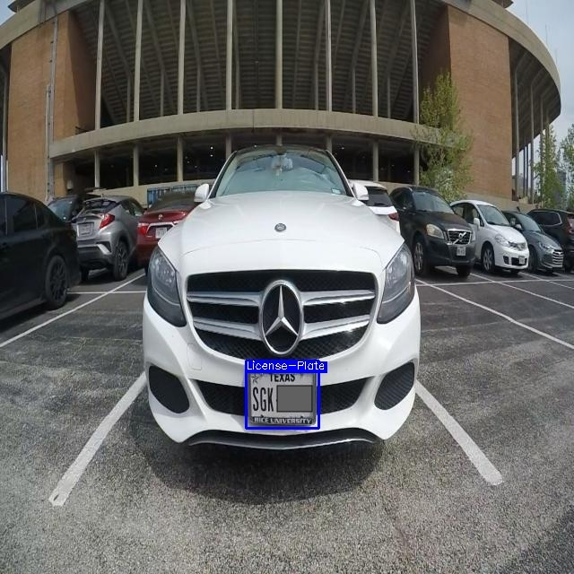


# **Future Applications and Project Roadmapping**

<!--- [78] --->

The Raspberry Pi 4B was selected for this proof-of-concept as it has become common amongst hobbyists and start-ups alike due to its’ low cost of entry in the compact computing market at 35$ at the time of this project. 

There were other edge device alternatives that could be used that run on similar architecture where I would expect similar performance and ease of development such as the Libre Computer Board AML-S905X-CC — dubbed “Le Potato” by some. However, for my purposes of this project being able to be referenced by other curious engineers I chose to go with a device that is more commonplace and battle tested in developer support forums. 


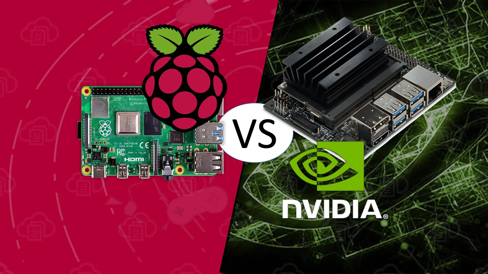

<!--- [79] --->

This choice however did come with the drawbacks of computing power that other more specialized and expensive platforms provide such as NVIDIA’s Jetson Nano that offers multiples more in terms of computing power however sits at above 125$ at the time of this project. The Raspberry Pi 4B could not handle real-time capturing and machine learning inference computation as it was limited by the 13.5 GFLOPS of performance and basic Broadcom Video Core IV. Nor was it expected to as this board was built for general purpose projects and not for niche AI applications as NVIDIA’s Jetson Nano products that have a rated 462 GFLOPS of performance. 

Now that it is evident that roboflow’s automated labeling and machine learning dataset curation tools are sufficient to greatly minimize development time, the edge device it is deployed on becomes the next focus of optimization. Currently, the Jetson Nano stands to be the most promising commercial over-the-counter edge device that would enable real-time functionalities for computer vision model performance testing. With the rise of vision transformers , ViT in shorthand, I hope that these models will soon become optimized enough to be able on such edge devices with sufficient computing capacity such as the Jetson Nano. 


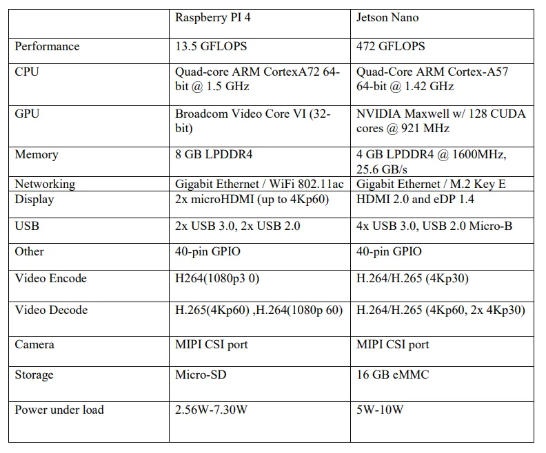


# **Conclusions and Next Steps**


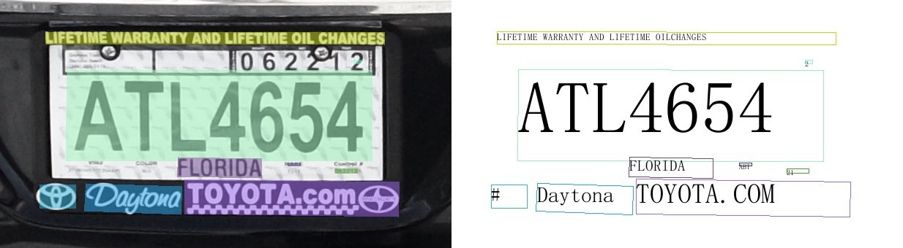

<!--- [81] --->

Overall, I found Roboflow’s multiple tools and infrastructure for machine learning applications to be quite welcomed. Many times throughout my machine learning career I had hoped that a solution such as their auto-labeling and machine learning performance optimization features would be soon relaible to use at scale. I foresee a promising path for Roboflow as it lowers the barrier for entry for early-stage start-ups looking to compete in the machine learning space as it deems responsibility for the very delicate nature of compute allocation for tasks such as training and tuning. Moving forward I would like to see this project grow to include OCR capabilities that would be able to go one step further in extracting the text data found on license plates and thus closing the loop of was once a very challenging issue of data availability in the world of open-source engineers looking for quick ways to build their own robust datasets from the ground up.
